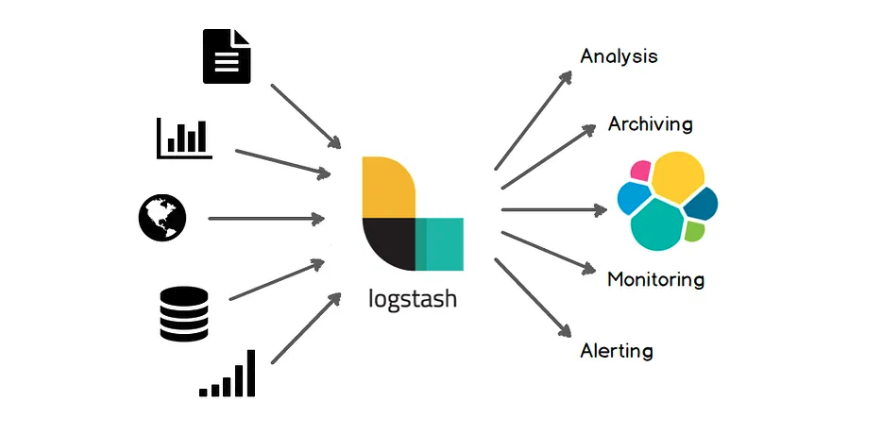
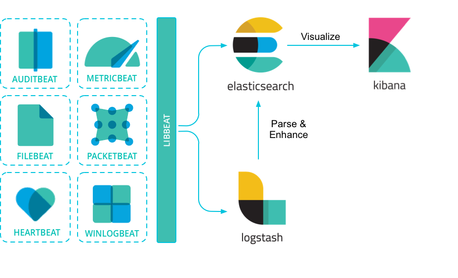

# Full Cycle Observability

Modern systems are like airplanes, they are complex and have many moving parts. Would you fly in an airplane that doesn't have a observability? I wouldn't. The same goes for software systems, we need to have a way to monitor our systems and understand what is happening inside them so that we can make informed decisions when something goes wrong.

Observability is a measure of how well internal states of a system can be inferred from knowledge of its external outputs. It helps us understand what is happening inside a system from the outside and is key to building reliable, scalable, and maintainable systems, specially in a microservices architecture or in big monoliths.

## Observability vs Monitoring

Observability and monitoring are closely related concepts in the realm of software development and system management. Monitoring traditionally focuses on collecting and analyzing specific metrics and data points to ensure the health and performance of a system. It often involves setting up predefined thresholds and alerts for key indicators. On the other hand, Observability is a more holistic approach that emphasizes understanding and debugging complex systems by gaining insights into their internal states and behaviors. Observability goes beyond traditional monitoring by providing the ability to ask ad-hoc questions, explore system behavior in real-time, and correlate events across distributed components. While monitoring helps identify issues, observability aids in understanding the root causes of problems and enables more effective troubleshooting in dynamic and interconnected systems. Together, they play essential roles in maintaining the reliability and performance of modern software applications.

## The Three Pillars of Observability

The three pillars of observability are: **metrics**, **logs**, and **traces**. They are the building blocks of observability and are the key to understanding what is happening inside a system.

### Metrics

Metrics are a way to measure and quantify the behavior of a system. They are usually numerical values that can be aggregated and analyzed over time. Metrics are the most common way to monitor systems and are the foundation of many monitoring tools. They are also the most common way to alert on system behavior like CPU usage, memory usage, and disk space usage for example.

### Logs

Logs are a way to record events that happen inside a system. They are usually text messages that contain information about what happened, when it happened, and where it happened. Logs are the most common way to debug systems and differently from metrics, they are not aggregated and analyzed oer time. Not correctly using logs can lead to a lot of problems like not having enough information to debug a problem that is happening in production.

### Traces

Traces are a way to record the lifecycle of a request as it flows through a system. They are usually composed of multiple spans that represent different operations that happened during the request lifecycle. Traces are the most common way to debug distributed systems and are key to understanding how requests are flowing through a system and how a system is behaving as a whole.

## ELK Stack

The ELK Stack is a collection of open-source products from Elastic designed to help users take data from any type of source and in any format and search, analyze, and visualize that data in real-time. The ELK Stack is a powerful tool for observability and is composed of three main products: **Elasticsearch**, **Logstash**, and **Kibana**.

### Elasticsearch

Elasticsearch is a distributed, RESTful search and analytics engine that is based on Apache Lucene. It provides a distributed, multitenant-capable full-text search engine with an HTTP web interface and schema-free JSON documents. Elasticsearch is the heart of the Elastic Stack and is responsible for storing and indexing data.

In this repository, Elasticsearch is configured as a service in the `docker-compose` file as follows:

```yaml
  elasticsearch:
    image: docker.elastic.co/elasticsearch/elasticsearch:7.13.0
    container_name: elasticsearch
    environment:
      - node.name=elasticsearch
      - cluster.name=es-docker-cluster
      - bootstrap.memory_lock=true
      - 'ES_JAVA_OPTS=-Xms512m -Xmx512m'
      - http.cors.enabled=true
      - http.cors.allow-origin="*"
      - discovery.type=single-node
    ulimits:
      memlock:
        soft: -1
        hard: -1
    volumes:
      - ./elasticsearch_data:/usr/share/elasticsearch/data
    ports:
      - 9200:9200
    networks:
      - observability
```

### Logstash

Logstash is a free and open source data collection and processing engine. It allows you to collect data from different sources, transform it, and send it to your desired destination. Logstash is the data processing component of the Elastic Stack and is responsible for collecting and processing data, in other words, it is responsible from getting data from your applications and sending it to Elasticsearch. It also has a lot of plugins that allow you to collect data from different sources like databases, message queues, and even other monitoring tools.



### Kibana

Kibana is a free and open user interface that lets you visualize your Elasticsearch data and navigate the Elastic Stack. It allows you to create dashboards and visualizations that help you understand what is happening inside your systems.

Kibana is configured as a service in the `docker-compose` file as follows:

```yaml
  kibana:
    image: docker.elastic.co/kibana/kibana:7.13.0
    container_name: kibana
    ports:
      - 5601:5601
    environment:
      ELASTICSEARCH_URL: http://elasticsearch:9200
      ELASTICSEARCH_HOSTS: '["http://elasticsearch:9200"]'
    networks:
      - observability
```

## Elastic Stack

The Elastic Stack is basically the ELK Stack plus Beats. Beats are lightweight data shippers that you install as agents on your servers to send specific types of operational data to Elasticsearch. Beats are the data collection component of the Elastic Stack and are responsible for collecting data from your servers and sending it to Elasticsearch.



### Metricbeat

[Metricbeat](https://www.elastic.co/pt/beats/metricbeat) is a lightweight shipper that you can install on your servers to periodically collect metrics from the operating system and from services running on the server. It is one of the most common ways to collect metrics from servers.

Metricbeat is configured as a service in the `docker-compose` file as follows:

```yaml
  metricbeat:
    image: docker.elastic.co/beats/metricbeat:7.13.0
    container_name: metricbeat
    user: root
    volumes:
      - /var/run/docker.sock:/var/run/docker.sock
      - ./beats/metric/metricbeat.yml:/usr/share/metricbeat/metricbeat.yml
    restart: on-failure
    networks:
      - observability
```

## Running Locally

1. Clone this repository
2. Run `docker-compose up -d`
3. Access Kibana at http://localhost:5601