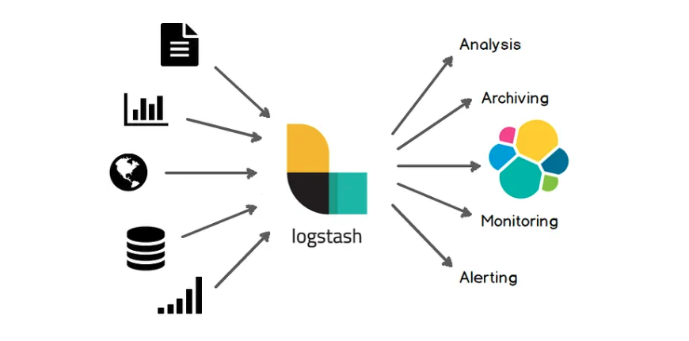
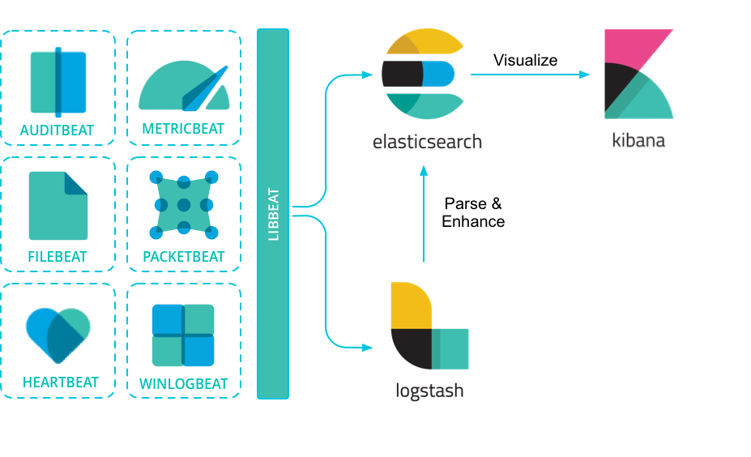
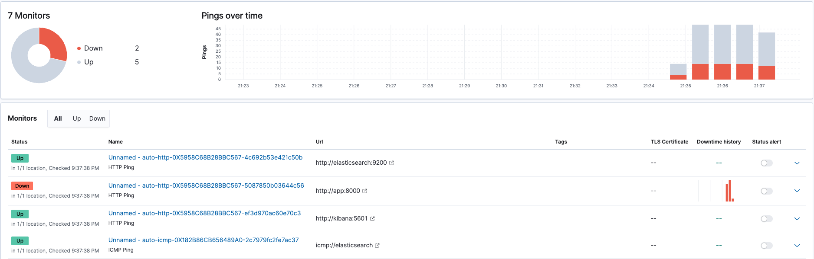
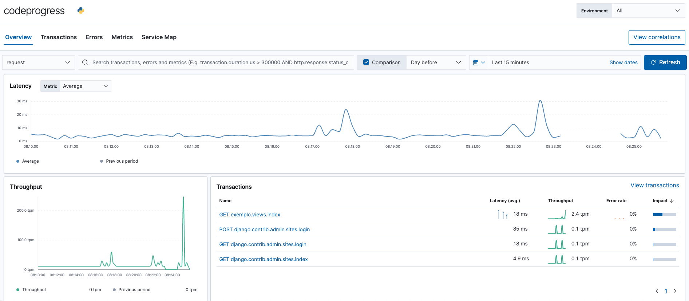

## ELK Stack

The ELK Stack is a collection of open-source products from Elastic designed to help users take data from any type of source and in any format and search, analyze, and visualize that data in real-time. The ELK Stack is a powerful tool for observability and is composed of three main products: **Elasticsearch**, **Logstash**, and **Kibana**.

### Elasticsearch

Elasticsearch is a distributed, RESTful search and analytics engine that is based on Apache Lucene. It provides a distributed, multitenant-capable full-text search engine with an HTTP web interface and schema-free JSON documents. Elasticsearch is the heart of the Elastic Stack and is responsible for storing and indexing data.

In this repository, Elasticsearch is configured as a service in the `docker-compose` file as follows:

```yaml
  elasticsearch:
    image: docker.elastic.co/elasticsearch/elasticsearch:7.13.0
    container_name: elasticsearch
    environment:
      - node.name=elasticsearch
      - cluster.name=es-docker-cluster
      - bootstrap.memory_lock=true
      - 'ES_JAVA_OPTS=-Xms512m -Xmx512m'
      - http.cors.enabled=true
      - http.cors.allow-origin="*"
      - discovery.type=single-node
    ulimits:
      memlock:
        soft: -1
        hard: -1
    volumes:
      - ./elasticsearch_data:/usr/share/elasticsearch/data
    ports:
      - 9200:9200
    networks:
      - observability
```

### Logstash

Logstash is a free and open source data collection and processing engine. It allows you to collect data from different sources, transform it, and send it to your desired destination. Logstash is the data processing component of the Elastic Stack and is responsible for collecting and processing data, in other words, it is responsible from getting data from your applications and sending it to Elasticsearch. It also has a lot of plugins that allow you to collect data from different sources like databases, message queues, and even other monitoring tools.



### Kibana

Kibana is a free and open user interface that lets you visualize your Elasticsearch data and navigate the Elastic Stack. It allows you to create dashboards and visualizations that help you understand what is happening inside your systems.

Kibana is configured as a service in the `docker-compose` file as follows:

```yaml
  kibana:
    image: docker.elastic.co/kibana/kibana:7.13.0
    container_name: kibana
    ports:
      - 5601:5601
    environment:
      ELASTICSEARCH_URL: http://elasticsearch:9200
      ELASTICSEARCH_HOSTS: '["http://elasticsearch:9200"]'
    networks:
      - observability
```

## Elastic Stack

The Elastic Stack is basically the ELK Stack plus Beats. Beats are lightweight data shippers that you install as agents on your servers to send specific types of operational data to Elasticsearch. Beats are the data collection component of the Elastic Stack and are responsible for collecting data from your servers and sending it to Elasticsearch.



### Metricbeat

[Metricbeat](https://www.elastic.co/pt/beats/metricbeat) is a lightweight shipper that you can install on your servers to periodically collect metrics from the operating system and from services running on the server. It is one of the most common ways to collect metrics from servers.

Metricbeat is configured as a service in the `docker-compose` file as follows:

```yaml
  metricbeat:
    image: docker.elastic.co/beats/metricbeat:7.13.0
    container_name: metricbeat
    user: root
    volumes:
      - /var/run/docker.sock:/var/run/docker.sock
      - ./beats/metric/metricbeat.yml:/usr/share/metricbeat/metricbeat.yml
    restart: on-failure
    networks:
      - observability
```

### Heartbeat

[Heartbeat](https://www.elastic.co/pt/beats/heartbeat) is a lightweight shipper that you can install on your servers to periodically check the status of your services and determine whether they are available. It is one of the most common ways to monitor services and health check them.

Heartbeat is configured as a service in the `docker-compose` file as follows:

```yaml
  heartbeat:
    image: docker.elastic.co/beats/heartbeat:7.13.0
    container_name: heartbeat
    volumes:
      - ./beats/heart/heartbeat.yml:/usr/share/heartbeat/heartbeat.yml
    environment:
      - setup.kibana.host=kibana:5601
    networks:
      - observability
```

And results in the following dashboard in the Uptime section of Kibana:



### APM Server

The Elastic [APM Server](https://www.elastic.co/pt/apm) is a key component within the Elastic Stack's Application Performance Monitoring (APM) solution. It facilitates the collection, processing, and storage of performance-related data from applications. APM agents integrated into application code or runtime capture metrics, errors, and transactions, which are then sent to the APM Server. The server processes and indexes this data, making it searchable and accessible through Elasticsearch. The stored information can be visualized and analyzed using Kibana, enabling developers and operators to monitor and troubleshoot application performance in real-time.

The APM Server is configured as a service in the `docker-compose` file as follows:

```yaml
  apm-server:
    image: docker.elastic.co/apm/apm-server:7.13.0
    container_name: apm-server
    environment:
      - ELASTIC_APM_SERVER_URL=http://apm-server:8200
      - ELASTIC_APM_SECRET_TOKEN=changeme
      - ELASTIC_APM_SERVICE_NAME=apm-server
      - ELASTIC_APM_LOG_LEVEL=debug
      - ELASTIC_APM_TRANSACTION_SAMPLE_RATE=1
    volumes:
      - ./apm-server/apm-server.yml:/usr/share/apm-server/apm-server.yml
    ports:
      - 8200:8200
    networks:
      - observability
```

And results in the following dashboard in the APM section of Kibana:



#### RUM

Real User Monitoring is a type of APM that allows you to collect data from your frontend applications and understand how they are performing. It is a great way to understand how users are experiencing the application and how you can improve their experience.

### Filebeat

[Filebeat](https://www.elastic.co/pt/beats/filebeat) is a lightweight shipper that you can install on your servers to periodically collect log files from the operating system and from services running on the server. It is one of the most common ways to collect logs from servers.

## Running Locally

1. Clone this repository
1. Run `./setup.sh`
1. Access Kibana at http://localhost:5601