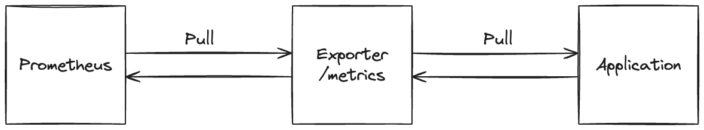
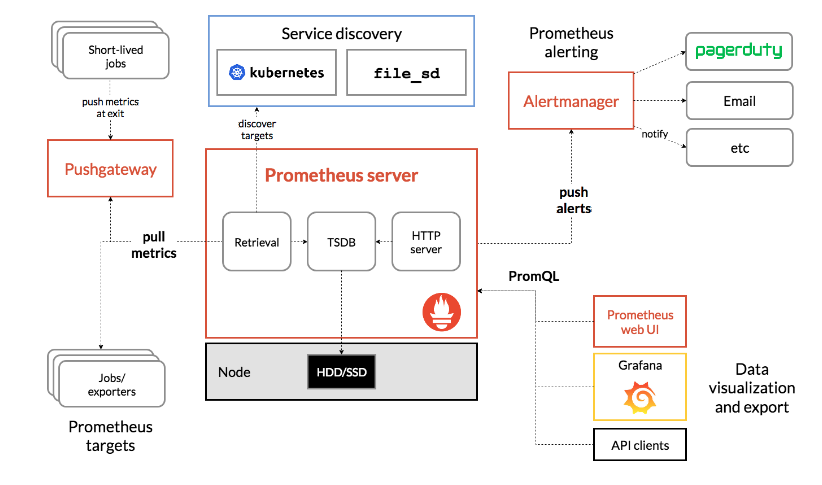

## Initial Concepts

There are two main ways of monitoring a system: **pull-based** and **push-based**. In the pull-based model, the monitoring system periodically connects to the system being monitored and requests metrics and logs. In the push-based model, the system being monitored periodically sends metrics and logs to the monitoring system. Prometheus uses the pull-based model through http, while Elastic Stack uses the push-based model, that is one of the main differences between them.

## Exporters

Prometheus leverages exporters to gather metrics from diverse systems and services, transforming them into a format intelligible to Prometheus. These exporters cover a broad spectrum, including specialized ones for MySQL, Nginx, Redis, and numerous others. Additionally, users have the flexibility to craft custom exporters tailored to their specific requirements.

We can understand the exporter as an interface between the system being monitored and Prometheus. Like exemplified below, it is responsible for collecting metrics from the system and exposing them in a format that Prometheus can understand.

## Architecture

This diagram illustrates the architecture of Prometheus and some of its ecosystem components:

Prometheus scrapes metrics from instrumented jobs, either directly or via an intermediary push gateway for short-lived jobs. It stores all scraped samples locally and runs rules over this data to either aggregate and record new time series from existing data or generate alerts. Grafana or other API consumers can be used to visualize the collected data.