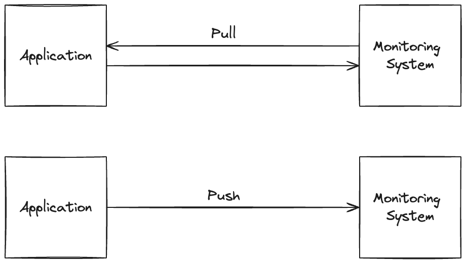

## Initial Concepts

There are two main ways of monitoring a system: **pull-based** and **push-based**. In the pull-based model, the monitoring system periodically connects to the system being monitored and requests metrics and logs. In the push-based model, the system being monitored periodically sends metrics and logs to the monitoring system. Prometheus uses the pull-based model through http, while Elastic Stack uses the push-based model, that is one of the main differences between them.

